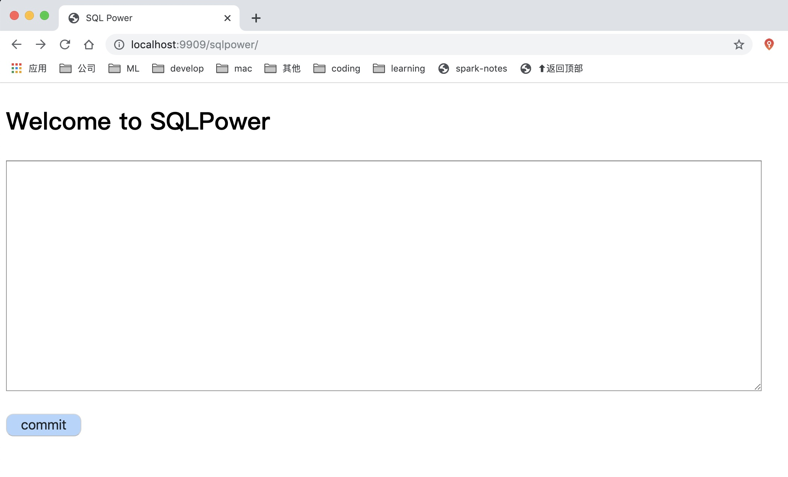

## SQLPower

SQLPower is a SQL-Based language which is built on spark/flink. Use one platform, one language for etl, bigData, AI, etc.

**All in SQLPower, SQL behind SQLPower.**

## Quick Start

1. input powSQL code
2. click commit submit
3. get the result

